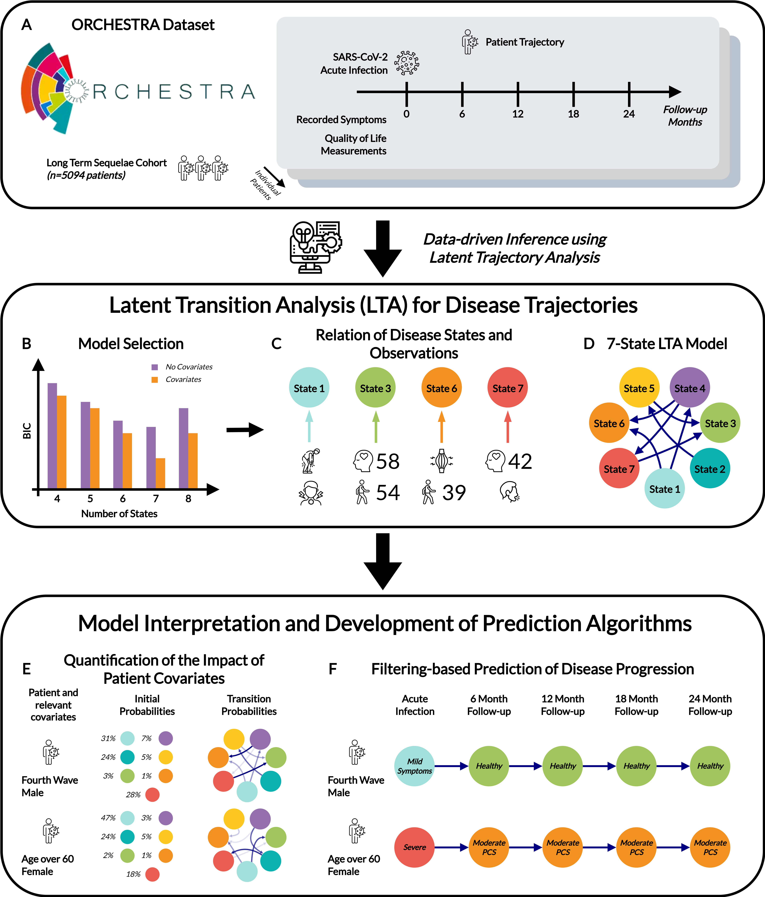

# Latent Transition Analysis for Longitudinal Studies of Post-Acute Infection Syndromes: A Multinational Investigation of Post-COVID-19 Condition

[](https://doi.org/10.5281/zenodo.17787060)

<p align="center">
  
</p>

This is a user-friendly version of the Julia codebase described in the paper "Latent Transition Analysis for Longitudinal Studies of Post-Acute Infection Syndromes: A Multinational Investigation of Post-COVID-19 Condition". It contains tools implemented in Julia for simulation, model estimation and visualisation of the modified discrete time, discrete space Hidden Markov Model. Be sure to see the [vignnete](vignette/vignette.ipynb) for usage!

- This also serves as the backend Julia codebase for federated estimation using [DataSHIELD](https://datashield.org/). The frontend server-side R functions can be found at [roygusinow/dsFedHMM](https://github.com/roygusinow/dsFedHMM).

## System Requirements

Please see the corresponding Project and Manifest files for Julia version and package dependecies. This codebase can be run on standard hardware and has been tested on Ubuntu 24.04.2.

## Installation

Usage via local development:

```
git clone https://github.com/roygusinow/LTA.git
cd LTA
julia --project
```

Then in the Julia REPL:
```
(LTA) pkg> instantiate
(LTA) pkg> precompile
julia> using LTA
```

which should install in a few seconds to minutes on depending on hardware and previous setup configurations.

## Quick start

A tutorial on how to use basic functionalities of the tools is shown in the Jupyter notebook: [vignette.ipynb](vignette/vignette.ipynb).
